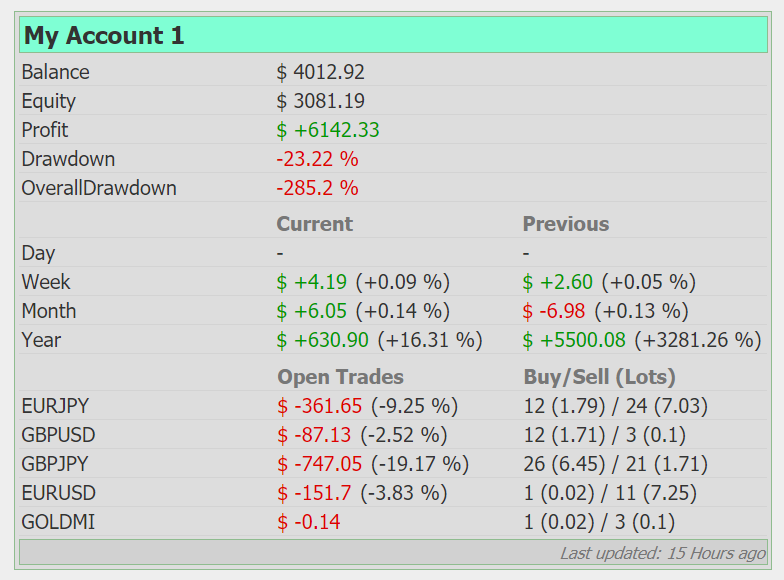

# Forex Board

The goal of the project is to provide better monitoring of forex accounts.

You need only to have registered public monitoring, for example on [myfxbook](https://www.myfxbook.com/) platform.



## Assumptions

This guide assumes you're using Unix-like operating system, but you can adopt instruction commands for Windows, etc.

## Requirements:

1. Install Golang as described [here](https://golang.org/doc/install).
```shell script
wget https://dl.google.com/go/go$GOVERSION.linux-amd64.tar.gz
sudo tar -C /usr/local -xzf go$GOVERSION.linux-amd64.tar.gz
```

2. Install `dep` utility as described [here](https://golang.github.io/dep/docs/installation.html).
```shell script
sudo curl https://raw.githubusercontent.com/golang/dep/master/install.sh | sh
```

## Installation

1. Download the source code of the project.

2. Unpack the archive and go to the project directory:
```shell script
$GOPATH/src/fxbd
```

3. Create configuration file `$GOPATH/src/fxbd/application_config.json` with your settings:
```json
{
  "port": 8080,
  "stats_dir": "/tmp/fxbd-stats",
  "accounts": [
    {
      "name": "My Account 1",
      "location": "https://www.myfxbook.com/members/user1/account1/id",
      "refresh_seconds": 300,
      "currency_divider": 100
    }
  ]
}
```
where:
- `port` - exposed port of application available on.
- `stats_dir` - folder where downloaded statistics located (must be writable).
- `accounts` - list of monitored accounts.
  - `name` - Visible name of account on dashboard.
  - `location` - url to original Forex monitoring page (currently supports [myfxbook](https://www.myfxbook.com/) only).
  - `refresh_seconds` - time period to download statistics (in seconds).
  - `currency_divider` - adjust currency values (for cent accounts use 100).

4. Get dependencies:
```shell script
dep init
dep ensure -v
```

5. Build the project:
```shell script
go build .
```

6. Run executable:
```shell script
./fxbd
```

7. Check the page [http://localhost:8080/](http://localhost:8080/).

## Settings for **MyFxBook** monitoring

You need properly configure you original monitoring platform.


## Contribution

Feel free to bring your ideas improving the visual or functionality of the project in 
[Issues](https://github.com/gonamore/fxbd/issues) or [Pull Requests](https://github.com/gonamore/fxbd/pulls).
